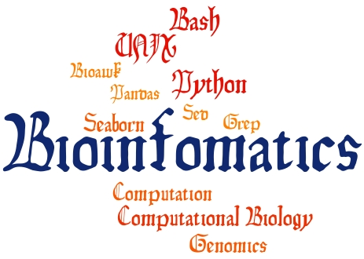

# BINF 2111/2111L - Introduction to Bioinformatics Computing

- Venue: 	University of North Carolina at Charlotte (UNCC)
- Date: 	Fall 2021
- Credits: 4 credit class
- Meeting times: T/TH 11:30-12:45, TH lab 2:30-5:15 pm EST
- Office hours: TH 5:15-6:15 pm EST or by appointment. 
- Where/Location: Main/Uptown Center Campus - Bioinformatics building 217
- Style of instruction: Face-to-face Instructional Method
- Department: Bioinfomatics and Genomics (BiG)
- Textbooks: None required for this course
- Website for the course: https://github.com/raw-lab/BINF2111 

 

#### Instructors:	
##### Dr. Richard Allen White III
- Email: [mailto](mailto:rwhit101@uncc.edu)

##### Jose L. Figueroa
- Email: [mailto](mailto:jlfiguer@uncc.edu) 

### Course Description
Introduction of fundamentals of programming for bioinformatics (sometimes called “scripting”) using current programming languages and paradigms.  Introduces both the language and the use of the language within a Unix environment, demonstrating how interpreted languages serve both as a useful tool for writing and testing programs interactively and as a powerful data analysis and processing tool for bioinformatics.  Hands-on computing labs in which students learn bioinformatics computing and programming are also included.

### Bioinfomatic internship requirement waiver
Students who take BINF 6399 will not need to take BINF 6400 internship to satisfy degree requirements. 

#### Contact 
The point-of-contact for this project is [Dr. Richard Allen White III](https://github.com/raw-lab). 
If you have any questions or feedback, please feel free to get in touch by email.   
Dr. Richard Allen White III - [mailto](mailto:rwhit101@uncc.edu)  
Or [open an issue](https://github.com/raw-lab/BINF2111/issues).
